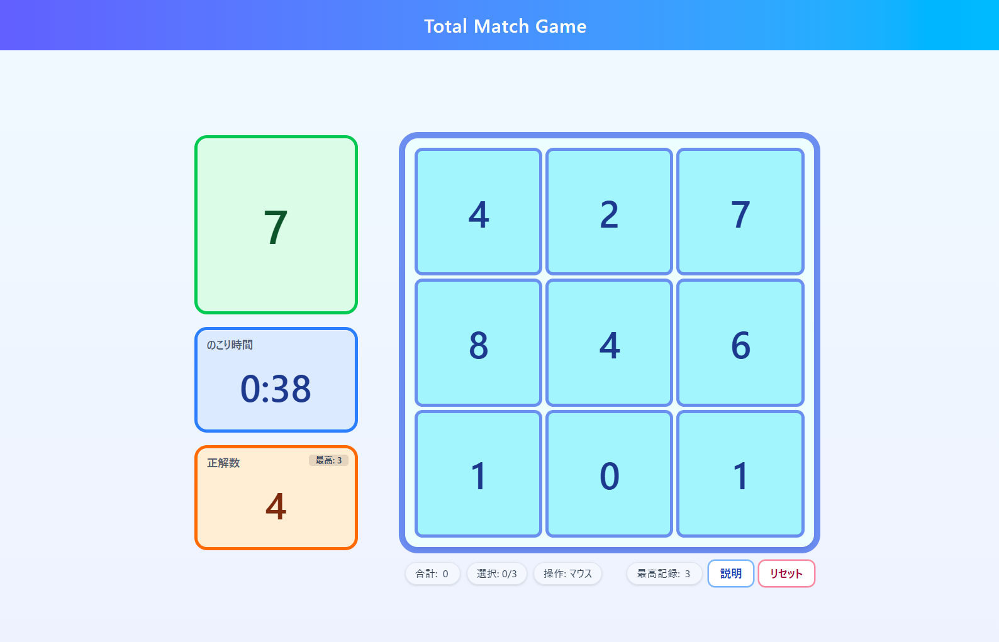
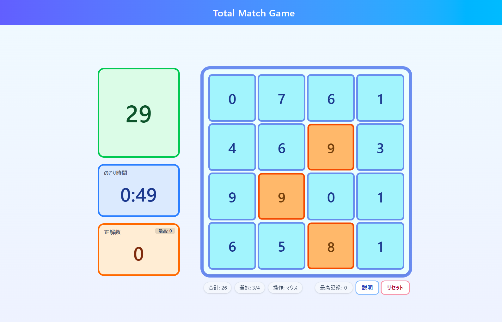
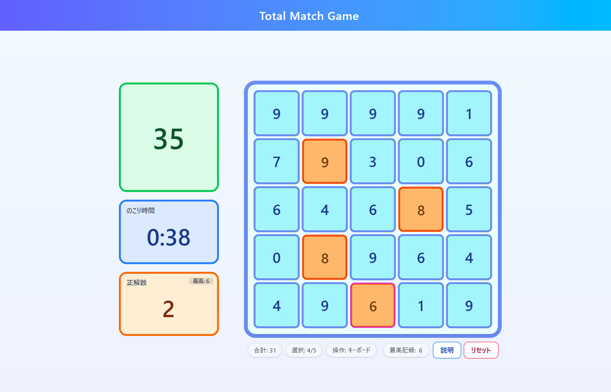
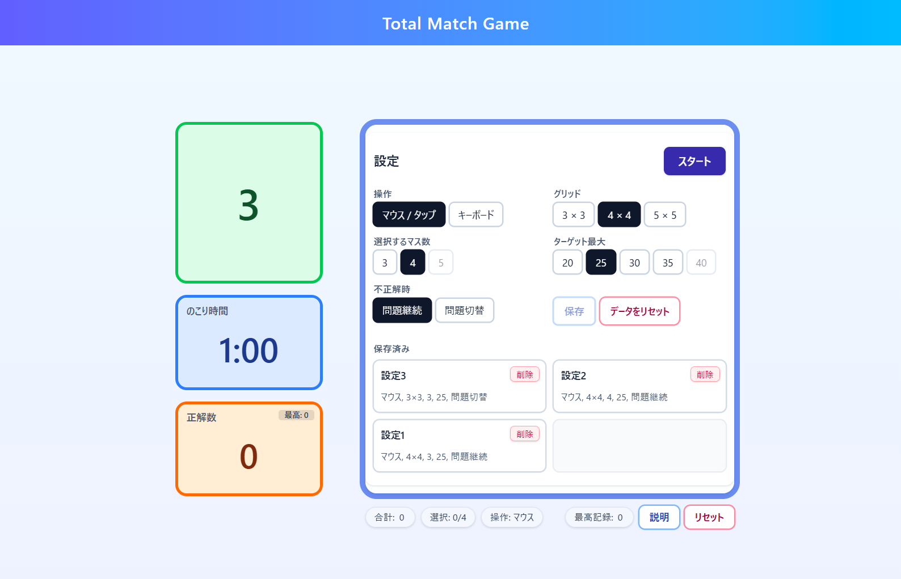
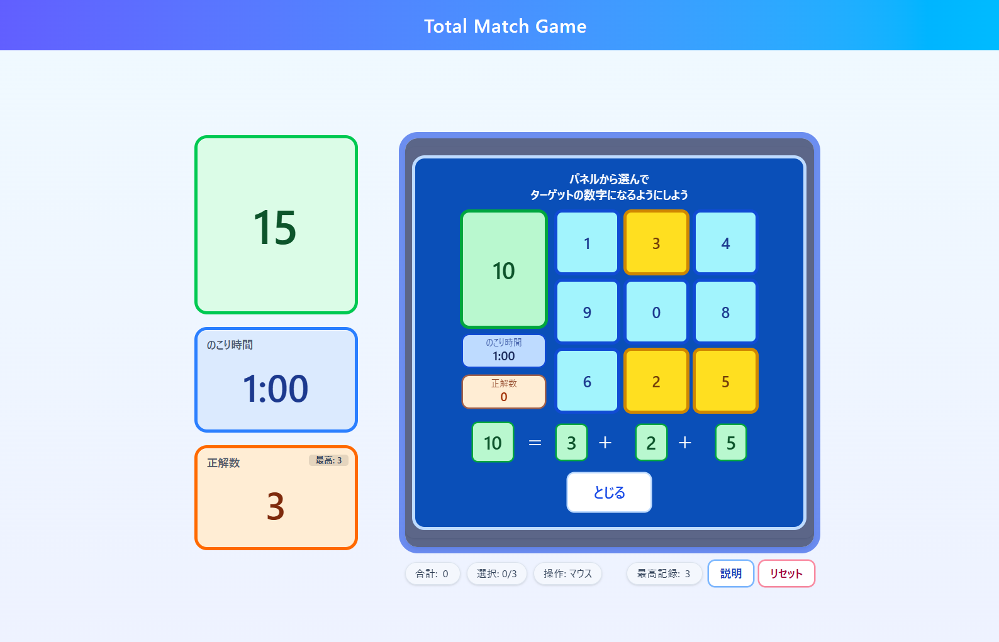
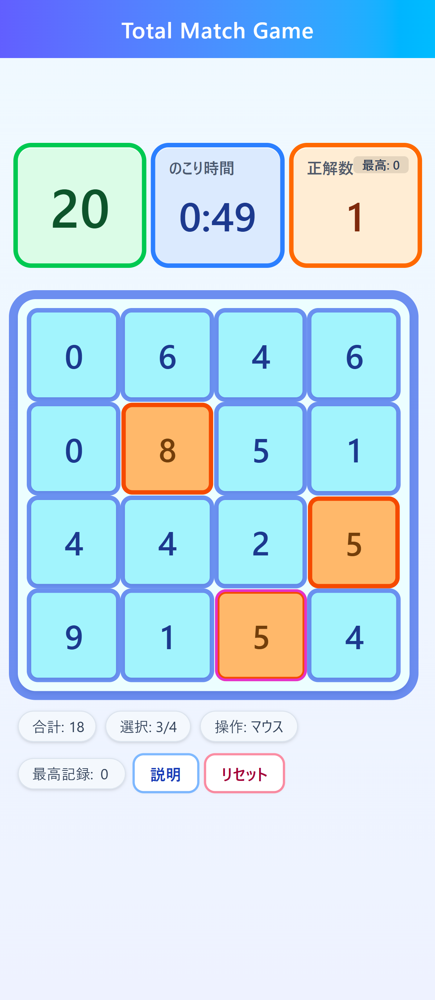
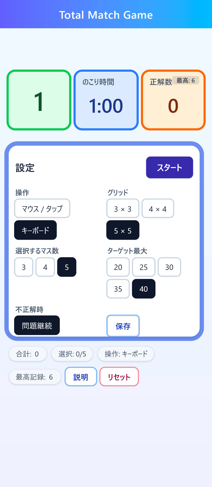

# Total Match Game

グリッドから **ちょうど N 個** の数字を選び、合計をターゲットに一致させるゲーム。  
マウス/タップ・キーボードの両方に対応し、設定ごとにハイスコアを保存します。

## デモ

公開URL:https://seiya-matsuoka.github.io/total-match-game/

[](https://github.com/seiya-matsuoka/total-match-game/actions/workflows/deploy.yml)

## スクリーンショット

<table>
  <tr>
    <td style="padding:6px;">
      
    </td>
    <td style="padding:6px;">
      
    </td>
  </tr>
  <tr>
    <td style="padding:6px;">
      
    </td>
    <td style="padding:6px;">
      
    </td>
  </tr>
  <tr>
    <td style="padding:6px;">
      
    </td>
    <td style="padding:6px;">
      
    </td>
  </tr>
  <tr>
    <td style="padding:6px;">
      
      
    </td>
  </tr>
</table>

## 特徴

- 盤面サイズ：**3×3 / 4×4 / 5×5**
- 選択枚数：**3 / 4 / 5**（盤面サイズに応じて選択肢を制限）
- ターゲットの最大値（難易度）：
  - 3×3 → 20 / 25 / 30
  - 4×4 → 上記 + 35
  - 5×5 → 上記 + 40
- 不正解時の動作：**問題継続** / **問題切替**
- **ハイスコア**：設定ごとに保存（ブラウザの `localStorage`）
- **キーボード操作**：矢印キーで移動、**Enter/Space** で選択/解除
- **マウス/タップ操作**：クリック/タップで選択/解除、ホバーでハイライト
- **モバイル最適化**：スマホでも快適に遊べる UI（レスポンシブ対応）

## ルール

- N×N のグリッドから **指定された枚数** だけ数字を選びます
- 選んだ数字の合計が **ターゲット値** と一致すれば正解です
- 制限時間内の **正解数** を競います

## セットアップ

```bash
npm i
npm run dev
```

- 本番ビルド：`npm run build`
- ビルドのプレビュー：`npm run preview`

## 画面構成

- **左サイドバー**：ターゲット / 残り時間 / スコア / 最高記録
- **盤面**：数字グリッド（選択・フォーカス・ホバーの視覚表現あり）
- **ステータス行**：合計 / 選択数 / 操作モード、説明・リセット
- **設定画面**：各種パラメータの変更、**最大 4 件**のプリセット保存/適用/削除
- **タイムアップ画面**：スコアと最高記録、**もう一度 / 設定へ** ボタン

## セキュリティ / プライバシー

- このゲームは **外部通信を行いません**。データはすべて **ブラウザの** `localStorage` に保存されます（個人情報は扱いません）。
- 「データをリセット」ボタンで、アプリが使用するキーをまとめて削除できます。

## ディレクトリ構成

```bash
src/
├─ components/
│  ├─ Grid.tsx         # 盤面の表示/操作
│  ├─ Sidebar.tsx      # ターゲット/残り時間/スコア/最高記録
│  ├─ Settings.tsx     # 設定UI・保存プリセット
│  └─ HowTo.tsx        # 説明画面
├─ game/
│  ├─ generateRound.ts # 盤面生成（解の存在を保証）
│  ├─ config.ts        # GameConfig 型、保存/読込、ハイスコア管理
│  └─ types.ts         # ドメイン型
├─ ui/
│  └─ tokens.ts        # ピル/ボタン等の UI トークン
├─ App.tsx / main.tsx
└─ index.css
```

## 技術スタック

- **React (Vite)** + **TypeScript**
- **Tailwind CSS**
- ESLint + Prettier
- sonner（トースト通知）

## 開発メモ / 実装の要点

- **状態管理**：`App.tsx` にゲーム状態（`isRunning/ended`, `score`, `timeLeft`, 選択インデックス、フォーカスなど）を集中
- **盤面生成**：`generateRound` が NxN / picks / targetMax の制約を満たすラウンドを構築
- **設定の保存**：最後に使った設定・保存済みプリセット・最高記録を `localStorage` に保存
- **アクセシビリティ**：キーボード操作、フォーカス可視化、`aria-label` など
- **モバイル**：Safari/Chrome を中心にレイアウト検証

## デプロイ（GitHub Pages）

- `vite.config.js` の `base` を リポジトリ名に設定
- GitHub Actions（`deploy.yml`）が `main` への push で自動デプロイ
